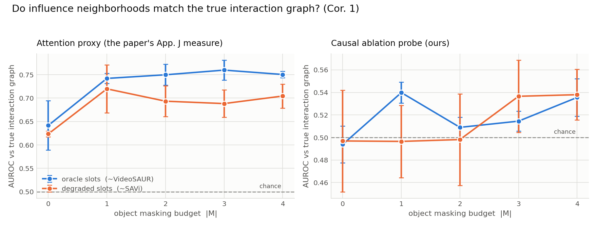

# causal-jepa-repro

An annotated, from-scratch reproduction of **Causal-JEPA: Learning World Models
through Object-Level Latent Masking**
([arXiv:2602.11389](https://arxiv.org/abs/2602.11389) — Nam, Le Lidec, Maes,
LeCun, Balestriero; ICML 2026).

Every file is written against the paper: methods quote the equation or appendix
they implement, and each deviation forced by the hardware is stated where it
happens. **[`REPORT.md`](REPORT.md) is the actual deliverable** — what
reproduced, what didn't, and what broke along the way.

Built on a **Colab frontend driving a Kaggle 2×T4 backend**.

## Headline findings

| Claim | Verdict |
|---|---|
| Object-level masking improves interaction-dependent prediction | **not reproduced** at this scale |
| Gains concentrate on counterfactual reasoning | **untestable here** — the VQA metric's ceiling-to-floor bracket is only 3.1 points |
| Optimal `\|M\|` depends on encoder quality | **partially** — heavy masking hurts the weak encoder ~2× more, as predicted |
| Attention aligns with the influence neighborhood (Cor. 1) | **reproduced**, +0.11 AUROC, in both encoder arms |
| …and that alignment reflects functional dependence | **contradicted** — a causal ablation probe stays at chance |
| 1.02% of input features, >8× faster planning | **reproduced** (1.02% exactly; 38× on a T4) |



The two results worth the most attention: object-level masking demonstrably
reshapes *where the predictor attends* — toward genuine interaction partners —
while every accuracy metric stays flat; and the attention-based evidence the
paper uses for that claim is **not** corroborated by a causal probe of the same
models. Details, including why C1/C2 could not be *tested* rather than merely
failing, are in [`REPORT.md`](REPORT.md).

---

## What the paper claims

C-JEPA is an object-centric world model. A frozen encoder turns each frame into
`N` object slots; a bidirectional transformer predictor is trained to fill in
masked slots. The contribution is *what gets masked*: instead of image patches,
whole **objects** are masked across the entire history window, leaving only the
earliest timestep as an identity anchor (Eq. 3). Since the masked object's own
past is gone, its state can only be recovered from the other objects — so
interaction reasoning becomes necessary to minimise the loss (Thm. 1).

Headline results: ~+21 points of counterfactual VQA accuracy on CLEVRER over the
same architecture without object-level masking, and Push-T planning at
comparable success using 1.02% of the input features and >8× faster MPC.

## What this repo reproduces

The paper's pipeline (CLEVRER + VideoSAUR + ALOE + Push-T/DINO-WM) is multiple
GPU-days. On 2×T4 in a single session we instead re-test the **claims** on a
synthetic multi-object collision world where every quantity the paper reasons
about is exactly computable:

| | paper | here |
|---|---|---|
| dynamics | CLEVRER videos | deterministic elastic-collision sim, energy-conserving to 0.000% |
| encoder | VideoSAUR / SAVi (frozen) | frozen oracle projection / deliberately degraded ("slot-bleeding") variant |
| counterfactual labels | CLEVRER annotations | exact — re-simulate with the object deleted |
| interaction graph | **not available** | **exact** — every collision logged with its timestep |

That last row is the point. The paper's own limitations say influence
neighborhoods were never validated against a real temporal interaction graph
("leaving this to future work", Sec. 7). Here we can, so we do — including a
*causal* ablation probe that the paper's attention-based proxy cannot substitute
for.

## Layout

```
cjepa/
  envs/interaction_world.py   CLEVRER-analogue physics + ground-truth collision graph
  encoders.py                 frozen slot encoders (strong / degraded)
  models/masking.py           object- / token- / tube-level masking  (Sec. 4.2, App. K)
  models/predictor.py         ViT-style bidirectional predictor      (Eq. 3, 4; App. E)
  models/losses.py            masked latent prediction               (Eq. 5, 6)
  train.py                    training loop                          (App. E.3)
  eval/qa.py                  CLEVRER-analogue VQA + ALOE probe      (Tab. 1 protocol)
  eval/counterfactual.py      probe-free do(remove k) rollout test
  eval/influence.py           influence-neighborhood validation      (Def. 1, Cor. 1)
scripts/
  smoke.py                    end-to-end shape/semantics checks
  test_eval.py                evaluation-harness correctness checks
  check_probe.py              is the VQA probe a usable instrument at all?
  run_sweep.py                the main |M| x encoder experiment
  eval_checkpoints.py         probe-free metrics over saved checkpoints
  planning_cost.py            Tab. 3 planning-efficiency benchmark
  aggregate.py                tables + figures
```

## Notebooks

| file | purpose |
|---|---|
| [`notebooks/causal_jepa_repro.ipynb`](notebooks/causal_jepa_repro.ipynb) | **run it** — clones the repo, builds the world, trains, plots |
| [`notebooks/causal_jepa_reading.ipynb`](notebooks/causal_jepa_reading.ipynb) | **read it** — print-oriented; figures embedded, all tables filled in, no setup cells |

Both are build artifacts (`scripts/build_notebook.py`, `scripts/build_reading_notebook.py`)
so prose and code can't drift and no stale outputs get committed. The reading
notebook pulls its numbers from `results/records.json` and its code from the real
source files, so what's printed is what was actually run.

To print it:

```bash
# renders the LaTeX via headless chromium — no TeX install needed
jupyter nbconvert --to webpdf --allow-chromium-download notebooks/causal_jepa_reading.ipynb

# or, if you have LaTeX, better typesetting for the equations
jupyter nbconvert --to pdf notebooks/causal_jepa_reading.ipynb
```

GitHub also renders it inline if you just want to read it in a browser.

## Reproducing

```bash
python -m scripts.smoke                       # physics, masking law, shapes
python -m scripts.check_probe                 # confirm the probe can measure
python -m scripts.run_sweep --shard 0 --n_shards 2   # one process per GPU
python -m scripts.eval_checkpoints
python -m scripts.planning_cost
python -m scripts.aggregate
```

`smoke.py` asserts the masking semantics directly against Sec. 4.2: all future
tokens masked, the `t0` identity anchor left visible, and `|M|` honoured.

## License

Code MIT. The paper is the authors'; this is an independent reproduction and is
not affiliated with them.
