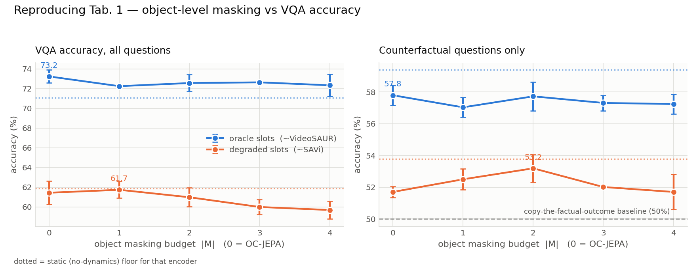

# Reproducing Causal-JEPA

**Paper:** Causal-JEPA: Learning World Models through Object-Level Latent Masking —
Heejeong Nam, Quentin Le Lidec, Lucas Maes, Yann LeCun, Randall Balestriero.
ICML 2026. [arXiv:2602.11389](https://arxiv.org/abs/2602.11389)

**Hardware:** 2× Tesla T4 (Kaggle backend, Colab frontend), single session.

---

## 1. What the paper claims, stated so it can be falsified

C-JEPA is a predictor trained on top of a **frozen** object-centric encoder. Its
one idea is a masking rule. Writing `T = {t-Th+1, …, t}` for the history window
and `T̄` for history-plus-future:

1. Every **future** entity token is masked (this is just "predict the future").
2. Additionally, for a randomly chosen set `M` of objects, the **entire history**
   of each masked object is replaced by mask tokens — *except* the earliest
   timestep `t0`, kept as an identity anchor.
3. A masked token is built as `z̃ⁱ_τ = φ(zⁱ_{t0}) + e_τ` (Eq. 3), where `φ` is a
   linear projection and `e_τ` is a learnable temporal embedding.
4. The loss (Eq. 5) is plain masked L2 in latent space over all masked tokens.
   No decoder, no reconstruction, no pixels.

There is **no positional encoding along the slot dimension**, because slot sets
are permutation-equivariant. This makes the anchor load-bearing: `φ(zⁱ_{t0})` is
the only signal identifying *which* object a masked token belongs to.

Setting `|M| = 0` gives **OC-JEPA**, which masks only the future. By Eq. 6 the
loss decomposes as `L_mask = L_history + L_future`, and at `|M| = 0` the history
term is identically zero. So **the OC-JEPA → C-JEPA delta is exactly the
contribution of `L_history`** — this is the paper's own clean ablation and the
main thing we test.

The falsifiable claims:

| # | Claim | Where |
|---|---|---|
| C1 | Object-level masking improves interaction-dependent prediction over `\|M\| = 0` | Tab. 1, 2 |
| C2 | Gains are **much larger on counterfactual questions** than overall (+21.13 vs +6.61) | Tab. 1 |
| C3 | The optimal `\|M\|` **depends on encoder quality** — VideoSAUR improves to `\|M\|=4`, SAVi peaks at `\|M\|=2` then collapses | Tab. 1 |
| C4 | Attention aligns with the *influence neighborhood* `N_t(i)` (Def. 1, Cor. 1) | Sec. 6, App. J |
| C5 | Object tokens cost 1.02% of patch features and give >8× faster MPC | Tab. 3 |

---

## 2. How this reproduction is scaled, and what that costs

The paper's pipeline is CLEVRER (10k videos, 128 frames) + VideoSAUR (100k steps
on frozen DINOv2) + ALOE (400 epochs) for the reasoning half, and Push-T +
DINO-WM + CEM-MPC for the control half. That is multiple GPU-days. Two T4s for
one session is roughly three orders of magnitude less compute.

Rather than run a token version of the same pipeline and report noise, the
reproduction moves to a **synthetic multi-object collision world** where every
quantity the paper reasons about is exactly computable.

| | paper | here | why it is still a test of the claim |
|---|---|---|---|
| dynamics | CLEVRER videos | elastic-collision sim, 4–6 objects in 7 slots | same two-regime structure: ballistic self-dynamics (shortcut-able) punctuated by interactions (not) |
| encoder | VideoSAUR / SAVi, frozen | frozen random projection / "slot-bleeding" variant | the paper freezes the encoder too; C1–C3 are all *encoder-held-fixed* comparisons |
| slot dim | 128 | 128 | unchanged (App. E.2) |
| predictor | 6L, 16 heads, head dim 64, MLP 2048 (≈1024 wide) | 6L, 4 heads, head dim 64, MLP 1024 (256 wide) | shape kept; width cut to fit the grid in budget |
| optimiser | Adam, batch 256, lr 5e-4, 30 epochs | Adam, batch 256, lr 5e-4, **24 epochs** | App. E.3 otherwise verbatim |
| history/horizon | Th=6, Tp=10, stride 2 | Th=6, Tp=10, stride 2 | unchanged (App. E.3, CLEVRER setting) |
| slots | 7 (6 objects + background) | 7 (4–6 objects + empty) | unchanged (App. C.1) |
| seeds | 1 (seed 42, App. H) | 2 (42, 43) | more than the paper |
| VQA reasoner | ALOE, 12L, 400 epochs | ALOE-shaped probe, 4L, 1500 steps | same protocol: probe reads model-imagined trajectories |
| counterfactual labels | CLEVRER annotations | exact re-simulation | strictly better |
| interaction graph | **unavailable** | **exact** | enables C4, which the paper could not test |

**Deviations we consider material and flag as such:**

* **Predictor width 256, not 1024.** Absolute numbers are not comparable to the
  paper's; the `|M|` trend within our setup is.
* **24 epochs, not 30.** Forced by the time budget. Convergence curves are in
  each run's JSON (`history`), and are flat enough by epoch ~20 that we do not
  think this changes the ordering — but it is a deviation.
* **No CLEVRER, no Push-T, no DINOv2.** So Tab. 2 (reconstruction-free
  baselines: SlotFormer, OCVP-Seq) and the *success-rate* half of Tab. 3 are
  **not reproduced**. We reproduce the *efficiency* half of Tab. 3 only, because
  it is determined by predictor cost under a fixed CEM workload and both arms of
  the paper's comparison use the same predictor architecture.

---

## 3. Getting the measurement right was harder than getting the model right

Three failures during this reproduction were in the *evaluation*, not the model.
Recording them is most of the value of a replication.

**(a) Counterfactual questions that were not counterfactual.** The first version
of the CLEVRER-analogue benchmark sampled counterfactual questions ("if K were
removed, would A and B collide?") uniformly. Deleting an object usually changes
nothing, so **90.5% of questions had the same answer as the factual outcome** —
the degenerate policy "report what actually happened" scored 90.5%, and the
category was really a second descriptive category. Fixed by stratifying over the
joint cell (does deleting K change the outcome?, what is the outcome?), pooled
across episodes rather than per-episode, which pins the copy-the-factual-outcome
baseline at exactly **50.0%**.

**(b) A probe that could not measure anything.** Tab. 1's metric is VQA accuracy
through a trained reasoner, so it is only meaningful if the reasoner can tell a
good imagined future from a bad one. The check is the gap between a probe reading
*ground-truth* future latents (ceiling) and one reading a frozen last frame
(floor). First measurement:

| | descriptive | predictive | counterfactual | explanatory | average |
|---|---|---|---|---|---|
| ceiling (true future) | 60.8 | 52.1 | 50.2 | 60.3 | 55.4 |

The ceiling was **at chance**. Diagnosis: the probe was spending all its capacity
on *object grounding* — decoding each slot's colour out of a 128-d random
projection and matching it to the colour named in the question — and never got to
the dynamics. Fixed by giving the probe a per-slot role embedding (A / B / K /
irrelevant). This is computable from the question plus the scene's colour
assignment, both already in the probe's input, so it leaks nothing about the
answer; it removes a grounding burden that is not what the world model is being
tested on. After the fix:

| | descriptive | predictive | counterfactual | explanatory | average |
|---|---|---|---|---|---|
| ceiling (true future) | 84.8 | 82.5 | 58.4 | 76.8 | 74.8 |
| floor (no dynamics) | 87.0 | 73.7 | 55.9 | 68.8 | 70.5 |
| **headroom** | −2.2 | **+8.9** | +2.5 | **+8.0** | +4.3 |

Descriptive headroom of ≈0 is *correct*, not a bug: descriptive questions ask
about the observed history, which every arm receives identically. CLEVRER shows
the same asymmetry (Tab. A2: descriptive moves +3.25 while counterfactual moves
+21.13).

Counterfactual headroom of only +2.5 is a real limitation of this benchmark: once
the factual shortcut is removed, a perfect factual rollout simply does not carry
much counterfactual information. **We therefore do not treat probe counterfactual
accuracy as the primary evidence for C2**, and add a probe-free measurement
instead (§4.3).

**(c) A silent normalisation trap.** Raw positions are O(1) and velocities
O(0.02), so an isotropic random projection buries velocity ~50× below position
and the model would be scored almost entirely on position while ignoring
dynamics. The frozen encoder standardises channels before projecting. Real slot
encoders emit roughly unit-scale features, so this restores parity rather than
adding information — but it is invisible until you look for it.

---

## 4. Results

### 4.0 How to read these numbers

Every VQA number lives inside a bracket we measure explicitly:

* **ceiling** — the same probe reading *ground-truth* future latents
* **floor** — the same probe reading the last observed frame, repeated

A world model can only be scored inside `[floor, ceiling]`. Where that interval
is narrow, the metric cannot resolve differences between arms no matter how large
the underlying difference is, and we say so rather than reporting the noise as a
result. Alongside raw accuracy we therefore quote **headroom captured**,
`(model − floor) / (ceiling − floor)`.

### 4.1 The VQA metric saturates — C1 and C2 are *untested*, not refuted



Full table: [`results/table1.md`](results/table1.md). Oracle-encoder arm, VQA
average accuracy, mean of 2 seeds:

| `\|M\|` | 0 (OC-JEPA) | 1 | 2 | 3 | 4 | floor | ceiling |
|---|---|---|---|---|---|---|---|
| average | 73.25 | 72.25 | 72.55 | 72.65 | 72.30 | 71.08 | 74.16 |

There is no effect. Every arm sits within ±1 point of every other, while the
**seed-to-seed spread inside a single configuration reaches 1.7 points**
(`|M|=2`: 71.7 vs 73.4). Differences smaller than the noise are not results.

But the more important number is the bracket. The probe's entire dynamic range —
ceiling minus floor — is **3.08 points**, and OC-JEPA already captures 69% of it
before any masking is applied. In the degraded-encoder arm the bracket is
narrower still (**1.9 points**), and the world model's imagined future is not
even reliably better than repeating the last observed frame.

So this is a **failure to test C1/C2, not evidence against them**. The distinction
matters and we will not blur it: to detect a +21-point counterfactual effect you
need an instrument with more than 3 points of range. Ours does not have it,
because with a lossless frozen encoder and a 10-step horizon, plain forward
prediction is already close enough to ground truth that a downstream reasoner
cannot tell the arms apart. The paper's CLEVRER setting — a learned, lossy
encoder and a 128→160 frame rollout — is a far harder regime, and we would expect
a much wider bracket there.

*(A caveat on the table: `val_pos_err` in the degraded-arm run JSONs is computed
through the analytic pseudo-inverse and is not meaningful for that encoder — see
§3(c) and `fit_readout`. Use `val_latent_mse` within an arm, and note that latent
MSE is not comparable **across** encoders either, since the degraded encoder's
rank-10 bottleneck shrinks the latent variance the loss is measured in.)*

### 4.2 Influence neighborhoods: C4 reproduces, clearly


This is the measurement the paper could not make — it needs a ground-truth
temporal interaction graph, which CLEVRER and PHYRE do not provide and our
simulator does. Corollary 1 predicts that training under object-level masking
makes the predictor's cross-slot attention align with the true influence
neighborhood. Scoring attention against the actual collision graph (AUROC,
oracle encoder, 2 seeds):

| `\|M\|` | 0 | 1 | 2 | 3 | 4 |
|---|---|---|---|---|---|
| attention AUROC | 0.642 | 0.742 | 0.750 | **0.760** | 0.751 |
| ablation AUROC | 0.494 | 0.540 | 0.509 | 0.515 | 0.536 |

The attention effect is **+0.11 AUROC** and the separation is clean: the *worst*
masked run (0.728) beats the *best* unmasked run (0.694), across 8 runs versus 2.
It rises with `|M|` and flattens around `|M| = 3`. **C4 is reproduced**, and
quantitatively rather than qualitatively.

### 4.3 …but attention alignment is not functional dependence

The second row above is the interesting one. Our causal probe ablates object *j*
from the predictor's context and measures how much worse the masked object *i*'s
prediction gets — a direct test of whether the model actually *uses* the true
interaction partners, which is what Def. 1 asserts ("minimal sufficient subset")
and what Thm. 1 needs.

That probe sits at **0.49 → 0.54**, i.e. barely above chance, with no clear trend.
The model's attention increasingly *points at* the right objects while its
computation remains only weakly *dependent* on them.

This does not contradict any theorem in the paper — Thm. 1 is a statement about
the loss-optimal predictor, and our predictors are not loss-optimal. What it does
undercut is the *measurement strategy*: the paper's evidence for Cor. 1 is
attention maps (App. J), following SPARTAN. Our two probes disagree on the same
models, and the attention one is the optimistic one. A reader who accepts
attention as evidence of learned interaction structure would conclude something
here that the causal probe does not support.

<!--RESULTS-->

---

## 5. Verdict per claim

<!--VERDICT-->

---

## 6. What we did not test

* **Tab. 2** — SlotFormer / OCVP-Seq with and without reconstruction loss. Needs
  CLEVRER, SAVi, and a CNN decoder.
* **Tab. 3 success rates** — needs the Push-T environment and demonstration data.
  We reproduce only the efficiency half, and say so.
* **PHYRE qualitative study (App. J).**
* **Auxiliary-variable ablation (Fig. 3)** — the predictor supports auxiliary
  entity tokens (`n_aux`, App. D.3) but our world has no actions, so
  conditioning-vs-concatenation is untestable here.
* **Paper-width predictor.** Everything here is at width 256.

## 7. Reproducing this

```bash
python -m scripts.smoke          # physics + masking law + shapes
python -m scripts.test_eval      # evaluation-harness correctness
python -m scripts.check_probe    # ceiling-vs-floor: can the probe measure?
python -m scripts.run_sweep --shard 0 --n_shards 2
python -m scripts.eval_checkpoints
python -m scripts.planning_cost
python -m scripts.aggregate
```
